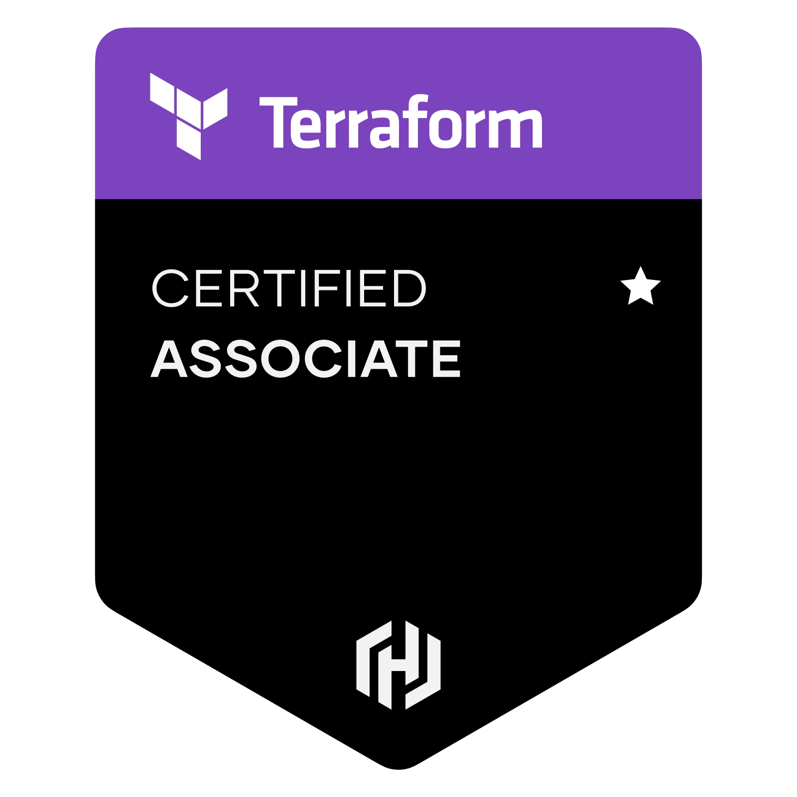

# HCTA Terraform Associate Certification (003) — Study Guide

Overview  
https://www.hashicorp.com/certification/terraform-associate

Study Guide  
https://developer.hashicorp.com/terraform/tutorials/certification-003/associate-study-003

Demos  
https://terraformguru.com/terraform-certification-using-aws-cloud/

  

 

---  

**Topic**	| TF files |
--------- | -------- |
[Terraform CLI](cli/README.md)  | [Files](cli/)  |
[Terraform Workspaces](workspaces/README.md)  | [Files](workspaces/)  |
[Terraform State](state/README.md)  | [Files](state/)  |
[Terraform Input Variables](variables/README.md)  | [Files](variables/)  |
[Terraform Plan Outputs](outputs/README.md)  | [Files](outputs/) |
[Terraform Built-in Functions ](builtins/README.md)  | [Files](builtins/)  |
[Terraform Dynamic Blocks](dynamic/README.md)  | [Files](dynamic/)  |
[Terraform Cloud](tfc/README.md)  | [Files](tfc/)  |
[Terraform Enterprise](tfe/README.md)  | [Files](tfe/)  |