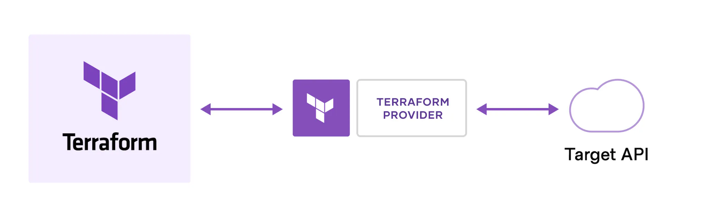

# HCTA Section 3 - Terraform basics

Section | Description |
------- | ----------- |  
**3**	| **Understand Terraform basics**
3a | [Install and version Terraform providers](#3a--install-and-version-terraform-providers)
3b | [Describe plugin-based architecture](#3b--describe-plugin-based-architecture)
3c | [Write Terraform configuration using multiple providers](#3c--write-terraform-configuration-using-multiple-providers)
3d | [Describe how Terraform finds and fetches providers](#3d--describe-how-terraform-finds-and-fetches-providers)

---  

## 3a	- Install and version Terraform providers

The default way to install provider plugins is from a provider registry.

Terrform Registry  
https://registry.terraform.io/  

A provider configuration is created using a provider block:

```hcl
provider "google" {
  project = "acme-app"
  region  = "us-central1"
}
```

A `provider_installation` block allows overriding Terraform's default installation behaviors, so you can force Terraform to use a local mirror for some or all of the providers you intend to use.

```hcl
provider_installation {
  filesystem_mirror {
    path    = "/usr/share/terraform/providers"
    include = ["example.com/*/*"]
  }
  direct {
    exclude = ["example.com/*/*"]
  }
}
```

---  

## 3b	- Describe plugin-based architecture

Terraform is built on a plugin-based architecture, enabling developers to extend Terraform by writing new plugins or compiling modified versions of existing plugins.

2 main parts: 
- **Terraform Core**: uses remote procedure calls (RPC) to communicate with Terraform Plugins, and offers multiple ways to discover and load plugins to use. 
- **Terraform Plugins**: expose an implementation for a specific service, such as AWS, or provisioner, such as bash. Written in Go.  



Each provider adds a set of `resource` types and/or `data` sources that Terraform can manage.

---  

## 3c	- Write Terraform configuration using multiple providers

You can define multiple providers in your Terraform code like this:
```hcl
terraform {
  required_providers {
    aws = {
      source  = "hashicorp/aws"
      version = "~> 5.0"
    }
    azurerm = {
      source  = "hashicorp/azurerm"
      version = "=3.0.0"
    }
    google {}
  }
}

# Configure the Amazon AWS Provider
provider "aws" {
  region = "us-east-1"
}

# Configure the Microsoft Azure Provider
provider "azurerm" {
  features {}
}

# Configure the Google Cloud Platform Provider
provider "google" {
  project = "acme-app"
  region  = "us-central1"
}
```

You can optionally define multiple configurations for the same provider, and select which one to use on a per-resource or per-module basis, using the `alias` argument.

```hcl
# The default provider configuration; resources that begin with `aws_` will use
# it as the default, and it can be referenced as `aws`.
provider "aws" {
  region = "us-east-1"
}

# Additional provider configuration for west coast region; resources can
# reference this as `aws.west`.
provider "aws" {
  alias  = "west"     ### HERE
  region = "us-west-2"
}
```


---  

## 3d	- Describe how Terraform finds and fetches providers

The Terraform Registry is the main directory of publicly available Terraform providers, and hosts providers for most major infrastructure platforms.

Terraform Registry
https://registry.terraform.io/browse/providers


---  
