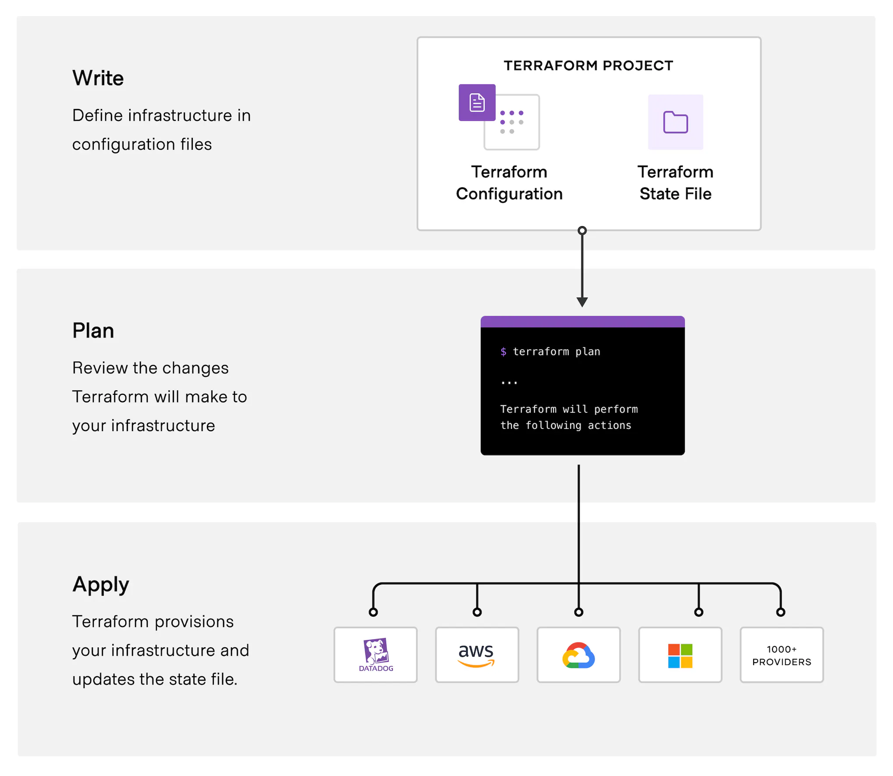

# HCTA Section 6 -- The core Terraform workflow

## Exam objectives


Section | Description    |
------- | -------------- |  
**6** | **Use the core Terraform workflow**
6a | [Describe Terraform workflow ( Write -> Plan -> Create )](#6a---describe-terraform-workflow--write---plan---create)
6b | [Initialize a Terraform working directory (terraform init)](#6b---initialize-a-terraform-working-directory-terraform-init)
6c | [Validate a Terraform configuration (terraform validate)](#6c---validate-a-terraform-configuration-terraform-validate)
6d | [Generate and review an execution plan for Terraform (terraform plan)](#6d---generate-and-review-an-execution-plan-for-terraform-terraform-plan)
6e | [Execute changes to infrastructure with Terraform (terraform apply)](#6e---execute-changes-to-infrastructure-with-terraform-terraform-apply)
6f | [Destroy Terraform managed infrastructure (terraform destroy)](#6f---destroy-terraform-managed-infrastructure-terraform-destroy)
6g | [Apply formatting and style adjustments to a configuration (terraform fmt)](#6g---apply-formatting-and-style-adjustments-to-a-configuration-terraform-fmt)


---  

## 6a	- Describe Terraform workflow ( Write -> Plan -> Create )

The core Terraform workflow consists of three stages:

- **Write**: You define resources, which may be across multiple cloud providers and services. For example, you might create a configuration to deploy an application on virtual machines in a Virtual Private Cloud (VPC) network with security groups and a load balancer.
- **Plan**: Terraform creates an execution plan describing the infrastructure it will create, update, or destroy based on the existing infrastructure and your configuration.
- **Apply**: On approval, Terraform performs the proposed operations in the correct order, respecting any resource dependencies. For example, if you update the properties of a VPC and change the number of virtual machines in that VPC, Terraform will recreate the VPC before scaling the virtual machines.



---  

## 6b	- Initialize a Terraform working directory (terraform init)

The `terraform init` command initializes a working directory containing Terraform configuration files:
- Terraform downloads any module referenced in the configuration
- Terraform initializes the backend (local, remote, ...)
- Terraform downloads the providers referenced in the configuration. 
- Terraform creates a lock file, which records the versions and hashes of the providers used in this run.  


```console
terraform init
```

```terraform
Initializing the backend...

Initializing provider plugins...
- Finding latest version of hashicorp/aws...
- Installing hashicorp/aws v5.10.0...
- Installed hashicorp/aws v5.10.0 (signed by HashiCorp)

Terraform has created a lock file .terraform.lock.hcl to record the provider
selections it made above. Include this file in your version control repository
so that Terraform can guarantee to make the same selections by default when
you run "terraform init" in the future.

Terraform has been successfully initialized!

You may now begin working with Terraform. Try running "terraform plan" to see
any changes that are required for your infrastructure. All Terraform commands
should now work.

If you ever set or change modules or backend configuration for Terraform,
rerun this command to reinitialize your working directory. If you forget, other
commands will detect it and remind you to do so if necessary.
```

---  

## 6c	- Validate a Terraform configuration (terraform validate)

The `terraform validate` command validates runs checks that verify whether a configuration is syntactically valid and internally consistent, regardless of any provided variables or existing state.  


```console
terraform validate
```

```terraform
Success! The configuration is valid.
```


```console
terraform validate
```

```terraform
╷
│ Error: Reference to undeclared resource
│ 
│   on main.tf line 13, in resource "aws_subnet" "subnet1":
│   13:   vpc_id     = aws_vpc.example.id
│ 
│ A managed resource "aws_vpc" "example" has not been declared in the root module.
```

---  

## 6d	- Generate and review an execution plan for Terraform (terraform plan)

The `terraform plan` command creates an execution plan, which lets you preview the changes that Terraform plans to make to your infrastructure. By default, when Terraform creates a plan it:
- Reads the current state of any already-existing remote objects to make sure that the Terraform state is up-to-date.
- Compares the current configuration to the prior state and noting any differences.
- Proposes a set of change actions that should, if applied, make the remote objects match the configuration.  

```console
terraform plan
```
```terraform

Terraform used the selected providers to generate the following execution plan. Resource actions are indicated with the following symbols:
  + create

Terraform will perform the following actions:

  # aws_subnet.subnet1 will be created
  + resource "aws_subnet" "subnet1" {
      + arn                                            = (known after apply)
      + assign_ipv6_address_on_creation                = false
      + availability_zone                              = (known after apply)
      + availability_zone_id                           = (known after apply)
      + cidr_block                                     = "10.0.0.0/24"
      + enable_dns64                                   = false
      + enable_resource_name_dns_a_record_on_launch    = false
      + enable_resource_name_dns_aaaa_record_on_launch = false
      + id                                             = (known after apply)
      + ipv6_cidr_block_association_id                 = (known after apply)
      + ipv6_native                                    = false
      + map_public_ip_on_launch                        = false
      + owner_id                                       = (known after apply)
      + private_dns_hostname_type_on_launch            = (known after apply)
      + tags                                           = {
          + "Name" = "subnet1"
        }
      + tags_all                                       = {
          + "Name" = "subnet1"
        }
      + vpc_id                                         = (known after apply)
    }

  # aws_vpc.section6 will be created
  + resource "aws_vpc" "section6" {
      + arn                                  = (known after apply)
      + cidr_block                           = "10.0.0.0/16"
      + default_network_acl_id               = (known after apply)
      + default_route_table_id               = (known after apply)
      + default_security_group_id            = (known after apply)
      + dhcp_options_id                      = (known after apply)
      + enable_dns_hostnames                 = (known after apply)
      + enable_dns_support                   = true
      + enable_network_address_usage_metrics = (known after apply)
      + id                                   = (known after apply)
      + instance_tenancy                     = "default"
      + ipv6_association_id                  = (known after apply)
      + ipv6_cidr_block                      = (known after apply)
      + ipv6_cidr_block_network_border_group = (known after apply)
      + main_route_table_id                  = (known after apply)
      + owner_id                             = (known after apply)
      + tags                                 = {
          + "Name" = "section6"
        }
      + tags_all                             = {
          + "Name" = "section6"
        }
    }

Plan: 2 to add, 0 to change, 0 to destroy.

Changes to Outputs:
  + vpc = {
      + arn                                  = (known after apply)
      + assign_generated_ipv6_cidr_block     = null
      + cidr_block                           = "10.0.0.0/16"
      + default_network_acl_id               = (known after apply)
      + default_route_table_id               = (known after apply)
      + default_security_group_id            = (known after apply)
      + dhcp_options_id                      = (known after apply)
      + enable_dns_hostnames                 = (known after apply)
      + enable_dns_support                   = true
      + enable_network_address_usage_metrics = (known after apply)
      + id                                   = (known after apply)
      + instance_tenancy                     = "default"
      + ipv4_ipam_pool_id                    = null
      + ipv4_netmask_length                  = null
      + ipv6_association_id                  = (known after apply)
      + ipv6_cidr_block                      = (known after apply)
      + ipv6_cidr_block_network_border_group = (known after apply)
      + ipv6_ipam_pool_id                    = null
      + ipv6_netmask_length                  = null
      + main_route_table_id                  = (known after apply)
      + owner_id                             = (known after apply)
      + tags                                 = {
          + Name = "section6"
        }
      + tags_all                             = {
          + Name = "section6"
        }
    }

──────────────────────────────────────────────────────────────────────────────────────────────────────────────────────────────────────────────────────────────────────────────────────

Note: You didn't use the -out option to save this plan, so Terraform can't guarantee to take exactly these actions if you run "terraform apply" now.
```
---  

## 6e	- Execute changes to infrastructure with Terraform (terraform apply)

The `terraform apply` command executes the actions proposed in a Terraform plan.  

      `-auto-approve` - Skips interactive approval of plan before applying.   

```console
terraform apply
```
```terraform

Terraform used the selected providers to generate the following execution plan. Resource actions are indicated with the following symbols:
  + create

Terraform will perform the following actions:

  # aws_subnet.subnet1 will be created
  + resource "aws_subnet" "subnet1" {
      + arn                                            = (known after apply)
      + assign_ipv6_address_on_creation                = false
      + availability_zone                              = (known after apply)
      + availability_zone_id                           = (known after apply)
      + cidr_block                                     = "10.0.0.0/24"
      + enable_dns64                                   = false
      + enable_resource_name_dns_a_record_on_launch    = false
      + enable_resource_name_dns_aaaa_record_on_launch = false
      + id                                             = (known after apply)
      + ipv6_cidr_block_association_id                 = (known after apply)
      + ipv6_native                                    = false
      + map_public_ip_on_launch                        = false
      + owner_id                                       = (known after apply)
      + private_dns_hostname_type_on_launch            = (known after apply)
      + tags                                           = {
          + "Name" = "subnet1"
        }
      + tags_all                                       = {
          + "Name" = "subnet1"
        }
      + vpc_id                                         = (known after apply)
    }

  # aws_vpc.section6 will be created
  + resource "aws_vpc" "section6" {
      + arn                                  = (known after apply)
      + cidr_block                           = "10.0.0.0/16"
      + default_network_acl_id               = (known after apply)
      + default_route_table_id               = (known after apply)
      + default_security_group_id            = (known after apply)
      + dhcp_options_id                      = (known after apply)
      + enable_dns_hostnames                 = (known after apply)
      + enable_dns_support                   = true
      + enable_network_address_usage_metrics = (known after apply)
      + id                                   = (known after apply)
      + instance_tenancy                     = "default"
      + ipv6_association_id                  = (known after apply)
      + ipv6_cidr_block                      = (known after apply)
      + ipv6_cidr_block_network_border_group = (known after apply)
      + main_route_table_id                  = (known after apply)
      + owner_id                             = (known after apply)
      + tags                                 = {
          + "Name" = "section6"
        }
      + tags_all                             = {
          + "Name" = "section6"
        }
    }

Plan: 2 to add, 0 to change, 0 to destroy.

Changes to Outputs:
  + vpc = {
      + arn                                  = (known after apply)
      + assign_generated_ipv6_cidr_block     = null
      + cidr_block                           = "10.0.0.0/16"
      + default_network_acl_id               = (known after apply)
      + default_route_table_id               = (known after apply)
      + default_security_group_id            = (known after apply)
      + dhcp_options_id                      = (known after apply)
      + enable_dns_hostnames                 = (known after apply)
      + enable_dns_support                   = true
      + enable_network_address_usage_metrics = (known after apply)
      + id                                   = (known after apply)
      + instance_tenancy                     = "default"
      + ipv4_ipam_pool_id                    = null
      + ipv4_netmask_length                  = null
      + ipv6_association_id                  = (known after apply)
      + ipv6_cidr_block                      = (known after apply)
      + ipv6_cidr_block_network_border_group = (known after apply)
      + ipv6_ipam_pool_id                    = null
      + ipv6_netmask_length                  = null
      + main_route_table_id                  = (known after apply)
      + owner_id                             = (known after apply)
      + tags                                 = {
          + Name = "section6"
        }
      + tags_all                             = {
          + Name = "section6"
        }
    }

Do you want to perform these actions?
  Terraform will perform the actions described above.
  Only 'yes' will be accepted to approve.

  Enter a value: yes

aws_vpc.section6: Creating...
aws_vpc.section6: Creation complete after 3s [id=vpc-03114dc7b132ebf8e]
aws_subnet.subnet1: Creating...
aws_subnet.subnet1: Creation complete after 1s [id=subnet-0f0ffb188aa6aab0c]

Apply complete! Resources: 2 added, 0 changed, 0 destroyed.
```

---  

## 6f	- Destroy Terraform managed infrastructure (terraform destroy)

The `terraform destroy` command is a convenient way to destroy all remote objects managed by a particular Terraform configuration.  

```console
terraform destroy
```
```terraform
aws_vpc.section6: Refreshing state... [id=vpc-03114dc7b132ebf8e]
aws_subnet.subnet1: Refreshing state... [id=subnet-0f0ffb188aa6aab0c]

Terraform used the selected providers to generate the following execution plan. Resource actions are indicated with the following symbols:
  - destroy

Terraform will perform the following actions:

  # aws_subnet.subnet1 will be destroyed
  - resource "aws_subnet" "subnet1" {
      - arn                                            = "arn:aws:ec2:us-east-1:405873723470:subnet/subnet-0f0ffb188aa6aab0c" -> null
      - assign_ipv6_address_on_creation                = false -> null
      - availability_zone                              = "us-east-1a" -> null
      - availability_zone_id                           = "use1-az4" -> null
      - cidr_block                                     = "10.0.0.0/24" -> null
      - enable_dns64                                   = false -> null
      - enable_lni_at_device_index                     = 0 -> null
      - enable_resource_name_dns_a_record_on_launch    = false -> null
      - enable_resource_name_dns_aaaa_record_on_launch = false -> null
      - id                                             = "subnet-0f0ffb188aa6aab0c" -> null
      - ipv6_native                                    = false -> null
      - map_customer_owned_ip_on_launch                = false -> null
      - map_public_ip_on_launch                        = false -> null
      - owner_id                                       = "405873723470" -> null
      - private_dns_hostname_type_on_launch            = "ip-name" -> null
      - tags                                           = {
          - "Name" = "subnet1"
        } -> null
      - tags_all                                       = {
          - "Name" = "subnet1"
        } -> null
      - vpc_id                                         = "vpc-03114dc7b132ebf8e" -> null
    }

  # aws_vpc.section6 will be destroyed
  - resource "aws_vpc" "section6" {
      - arn                                  = "arn:aws:ec2:us-east-1:405873723470:vpc/vpc-03114dc7b132ebf8e" -> null
      - assign_generated_ipv6_cidr_block     = false -> null
      - cidr_block                           = "10.0.0.0/16" -> null
      - default_network_acl_id               = "acl-04d244a88ac69eec3" -> null
      - default_route_table_id               = "rtb-06350976876b6d823" -> null
      - default_security_group_id            = "sg-0cab9a15587065372" -> null
      - dhcp_options_id                      = "dopt-07c384309727c49de" -> null
      - enable_dns_hostnames                 = false -> null
      - enable_dns_support                   = true -> null
      - enable_network_address_usage_metrics = false -> null
      - id                                   = "vpc-03114dc7b132ebf8e" -> null
      - instance_tenancy                     = "default" -> null
      - ipv6_netmask_length                  = 0 -> null
      - main_route_table_id                  = "rtb-06350976876b6d823" -> null
      - owner_id                             = "405873723470" -> null
      - tags                                 = {
          - "Name" = "section6"
        } -> null
      - tags_all                             = {
          - "Name" = "section6"
        } -> null
    }

Plan: 0 to add, 0 to change, 2 to destroy.

Changes to Outputs:
  - vpc = {
      - arn                                  = "arn:aws:ec2:us-east-1:405873723470:vpc/vpc-03114dc7b132ebf8e"
      - assign_generated_ipv6_cidr_block     = false
      - cidr_block                           = "10.0.0.0/16"
      - default_network_acl_id               = "acl-04d244a88ac69eec3"
      - default_route_table_id               = "rtb-06350976876b6d823"
      - default_security_group_id            = "sg-0cab9a15587065372"
      - dhcp_options_id                      = "dopt-07c384309727c49de"
      - enable_dns_hostnames                 = false
      - enable_dns_support                   = true
      - enable_network_address_usage_metrics = false
      - id                                   = "vpc-03114dc7b132ebf8e"
      - instance_tenancy                     = "default"
      - ipv4_ipam_pool_id                    = null
      - ipv4_netmask_length                  = null
      - ipv6_association_id                  = ""
      - ipv6_cidr_block                      = ""
      - ipv6_cidr_block_network_border_group = ""
      - ipv6_ipam_pool_id                    = ""
      - ipv6_netmask_length                  = 0
      - main_route_table_id                  = "rtb-06350976876b6d823"
      - owner_id                             = "405873723470"
      - tags                                 = {
          - Name = "section6"
        }
      - tags_all                             = {
          - Name = "section6"
        }
    } -> null

Do you really want to destroy all resources?
  Terraform will destroy all your managed infrastructure, as shown above.
  There is no undo. Only 'yes' will be accepted to confirm.

  Enter a value: yes

aws_subnet.subnet1: Destroying... [id=subnet-0f0ffb188aa6aab0c]
aws_subnet.subnet1: Destruction complete after 1s
aws_vpc.section6: Destroying... [id=vpc-03114dc7b132ebf8e]
aws_vpc.section6: Destruction complete after 1s

Destroy complete! Resources: 2 destroyed.
```
---  

## 6g	- Apply formatting and style adjustments to a configuration (terraform fmt)

The `terraform fmt` command is used to rewrite Terraform configuration files to a canonical format and style.   

```hcl
### BEFORE
resource "aws_subnet" "subnet1" {
  vpc_id = aws_vpc.section6.id  #### not aligned
  cidr_block = "10.0.0.0/24"

  tags = {
    Name = "subnet1"
  }
}
```
  
```console
terraform fmt
```
```terraform
main.tf
```  
  
```hcl
### AFTER
resource "aws_subnet" "subnet1" {
  vpc_id     = aws_vpc.section6.id #### aligned
  cidr_block = "10.0.0.0/24"

  tags = {
    Name = "subnet1"
  }
}
```

---  
