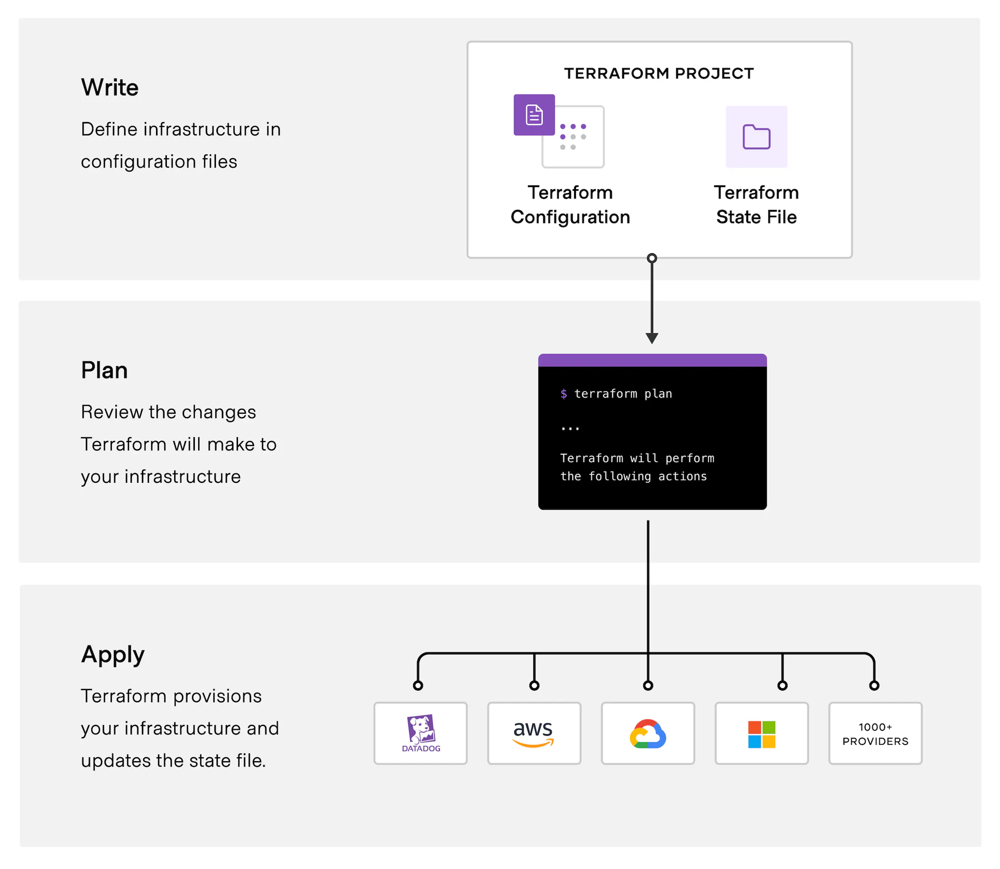

# HCTA Section 6 -- Use the core Terraform workflow

## Exam objectives

Section | Description |
------- | ----------- |  
**6** | **Use the core Terraform workflow**
6a | Describe Terraform workflow ( Write -> Plan -> Create )
6b | Initialize a Terraform working directory (terraform init)
6c | Validate a Terraform configuration (terraform validate)
6d | Generate and review an execution plan for Terraform (terraform plan)
6e | Execute changes to infrastructure with Terraform (terraform apply)
6f | Destroy Terraform managed infrastructure (terraform destroy)
6g | Apply formatting and style adjustments to a configuration (terraform fmt)

---  

## 6a	- Describe Terraform workflow ( Write -> Plan -> Create )

---  

## 6b	- Initialize a Terraform working directory (terraform init)

---  

## 6c	- Validate a Terraform configuration (terraform validate)

---  

## 6d	- Generate and review an execution plan for Terraform (terraform plan)

---  

## 6e	- Execute changes to infrastructure with Terraform (terraform apply)

---  

## 6f	- Destroy Terraform managed infrastructure (terraform destroy)

---  

## 6g	- Apply formatting and style adjustments to a configuration (terraform fmt)

---  
